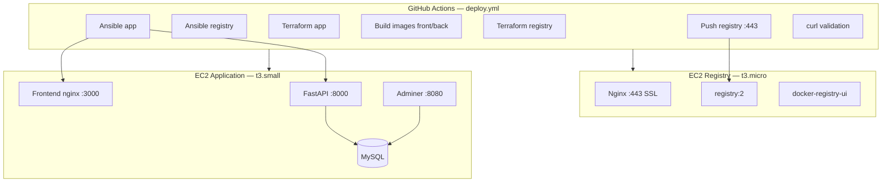

# Architecture — Déploiement automatisé

## Vue d'ensemble

Le projet repose sur **deux EC2 AWS distinctes**, provisionnées par Terraform et configurées par Ansible, orchestrées par le workflow GitHub Actions `deploy.yml` (déclenchement manuel).



## EC2 Registry (`infra/registry/`)

| Composant | Rôle |
|-----------|------|
| **Terraform** | EC2 `t3.micro`, clé SSH, security group (22, 80, 443) |
| **Ansible** | Docker, certificat SSL auto-signé, Nginx, registry + UI |
| **Nginx** | Terminaison HTTPS, routage `/v2/` → registry, `/` → UI |
| **Ports publics** | 22 (SSH), 80 (redirect HTTPS), 443 (registry + UI) |
| **Port 5000** | Interne uniquement (non exposé sur internet) |

## EC2 Application (`infra/app/`)

| Composant | Rôle |
|-----------|------|
| **Terraform** | EC2 `t3.small`, clé SSH, security group (22, 3000, 8000, 8080) |
| **Ansible** | Docker, login registry, pull images, `docker compose up` |
| **Services** | MySQL, Adminer, FastAPI, React (nginx) |
| **Images** | Tirées du registry privé (`<REGISTRY_IP>:443/inscription/...`) |

## Pipeline CI/CD (`/.github/workflows/deploy.yml`)

Déclenchement : **`workflow_dispatch`** (manuel).

| Étape | Action |
|-------|--------|
| 1 | `terraform apply` → EC2 registry |
| 2 | Génération `inventory.ini` (output Terraform) |
| 3 | Ansible → déploiement registry sécurisé |
| 4 | `terraform apply` → EC2 application |
| 5 | Build & push `backend` et `frontend` sur le registry |
| 6 | Génération `inventory.ini` applicatif |
| 7 | Ansible → pull images + stack complète |
| 8 | `curl` frontend, backend, adminer |

## Sécurité

- Tous les identifiants passent par **GitHub Secrets** (voir `.env.example`).
- Aucun mot de passe en dur dans les playbooks (variables d'environnement).
- Registry derrière **HTTPS** (certificat auto-signé).
- API registry non exposée directement (Nginx reverse proxy).

## Structure `infra/`

```
infra/
├── registry/
│   ├── main.tf
│   ├── playbook.yml
│   └── templates/
├── app/
│   ├── main.tf
│   ├── playbook.yml
│   └── templates/
└── docker/
    ├── Dockerfile.backend
    ├── Dockerfile.frontend
    └── nginx-frontend.conf
```

## Déploiement local du registry (hors CI)

Sous Windows, utiliser Ansible via Docker :

```bash
cd infra/registry
MSYS_NO_PATHCONV=1 docker run --rm \
  -v "$(pwd -W):/ansible" -w /ansible \
  -e REGISTRY_USERNAME -e REGISTRY_PASSWORD \
  cytopia/ansible:latest \
  sh -c "apk add --no-cache openssh-client && chmod 400 registry-key-terraform.pem && ansible-playbook -i inventory.ini playbook.yml"
```

Générer `inventory.ini` après Terraform :

```bash
terraform output -raw ansible_inventory > inventory.ini
```
